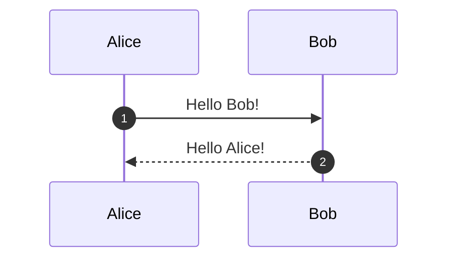

# Mermaid Diagram Editor

A web-based tool for creating, visualizing, and exporting Mermaid diagrams. This editor allows you to write Mermaid code, preview it in real-time, and export your diagrams as HTML or PDF files.

## Features

- 📝 **Code Editor**: Write and edit Mermaid diagram code with syntax highlighting
- 👁️ **Live Preview**: See your diagram rendered in real-time as you type
- 💾 **Save as HTML**: Export diagrams as standalone HTML files
- 📄 **Save as PDF**: Export diagrams as PDF documents
- 💾 **Local Storage**: Save and manage multiple diagrams in your browser
- 🎨 **Modern UI**: Beautiful, responsive interface

## Files

- `mermaid_editor.html` - Main editor application (use this file)
- `mermaid_sequence_diagram.html` - Example sequence diagram
- `mermaid_diagram.html` - Example diagram
- `mermaid_diagram_detailed.html` - Detailed example diagram
- `mermaid_diagram_interactive.html` - Interactive example diagram
- `mermaid_diagram_phases.html` - Phases example diagram

## Usage

1. Open `mermaid_editor.html` in your web browser
2. Paste or type your Mermaid code in the left panel
3. The diagram will automatically render in the preview panel
4. Click "Save as HTML" or "Save as PDF" to export your diagram
5. Saved diagrams are stored in your browser's local storage

## Supported Diagram Types

- Sequence Diagrams
- Flowcharts
- Gantt Charts
- Class Diagrams
- State Diagrams
- Entity Relationship Diagrams
- User Journey
- Gitgraph
- And more!

## Example Mermaid Code



## Technologies

- [Mermaid.js](https://mermaid.js.org/) - Diagram rendering
- [html2pdf.js](https://ekoopmans.github.io/html2pdf.js/) - PDF generation
- Vanilla JavaScript - No frameworks required

## MCP Server

This project includes an **MCP (Model Context Protocol) Server** that allows AI assistants to render Mermaid diagrams programmatically.

### What is the MCP Server?

The MCP server lets you pass Mermaid code to an AI assistant (like Claude in Cursor) and get rendered output (HTML, SVG, or PDF) automatically. No need to manually copy-paste code into the web editor!

### Quick Start

1. Install dependencies:
   ```bash
   cd mcp-server
   npm install
   ```

2. Configure in Cursor (or your MCP client):
   - See `mcp-server/README.md` for detailed configuration
   - Example config in `mcp-server/cursor-mcp-config.json.example`

3. Use it! Just ask your AI assistant:
   ```
   "Render this Mermaid code to HTML: [your code here]"
   ```

See `mcp-server/README.md` for full documentation.

## Deployment

This project is deployed on GitHub Pages. Simply open `mermaid_editor.html` in any modern web browser - no server required!

## License

MIT License

## Author

Piyush Verma (piyushverma24)
